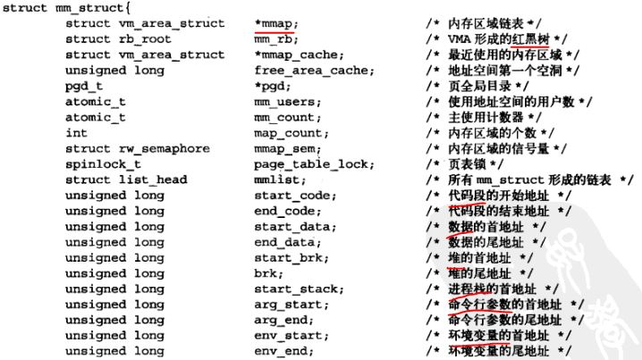
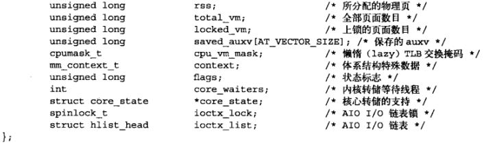
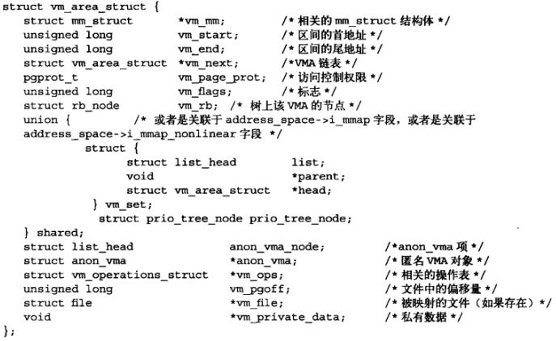
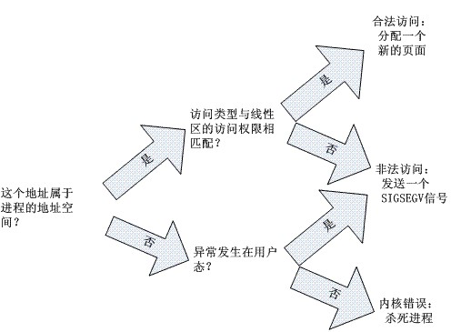

### 进程地址空间   
内核除了管理本身的内存外，还必须管理用户空间中进程的内存，我们称这个内存为进程地址空间，也就是系统中每个用户空间进程所看到的内存，linux操作系统采用虚拟内存技术，因此，系统中的所有进程之间以虚拟方式共享内存，对一个进程而言，它好像可以访问整个系统的所有物理内存。即使单独一个进程，它所拥有的地址空间也可以远远大于系统的物理内存。  
进程地址空间由进程可寻址的虚拟内存组成，而且更为重要的是内核允许进程使用这种虚拟内存中的地址。每个进程都有一个平坦的地址空间，平坦指的是地址空间的范围是一个独立连续的空间。通常情况下每个进程都有唯一的这种平坦地址空间，一个进程的地址空间与另一个进程的地址空间即使有相同的内存地址，实际上也彼此互不相干，这种进程称为线程。  
可以被合法访问的地址空间称为内存区域，通过内核，进程可以给自己的地址空间动态的添加或减少内存区域。进程只能访问有效区域内的内存地址，每个内存区域都有相关权限对有关进程的权限进行说明。进程地址空间中的任何有效的地址都只能位于唯一的区域，这些内存区域不能相互覆盖。  
#### mm_struct  
内存描述符mm_struct表示进程的地址空间，通过current->mm访问  
  
  
mmap指向的线性区链表用来遍历整个进程的地址空间。  
mm_rb红黑树用来定位一个给定的线性地址落在进程地址空间中的哪一个线性区中。  
通过内存描述符中的两个域mmap和mm_rb都可以访问线性区。事实上，它们都指向了同一个vm_area_struct结构，只是链接的方式不同。  
  
#### vm_area_struct  
vm_area_struct线性区描述符描述了指定地址空间内连续的一个独立内存范围。  
  

#### 进程何时会获得新的线性区？  
(1)  当创建一个新的进程时，一个全新的地址空间被分配给了新的进程。  
(2)  正在运行的进程装入新的程序（exec）时，旧的线性区被释放，新的线性区被分配给进程。  
(3)  进程持续向用户态堆栈增加数据。  
(4)  进程通过malloc扩展动态区。  
(5)  进程创建一个IPC共享线性区与其他合作进程共享数据。  
与创建、删除线性区相关的系统调用主要包括brk(), execve(), _exit(), fork(), mmap(), mmap2(), mremap(), munmap(), shmat(), shmdt()等。  
#### 缺页异常  
内核只是通过mmap()等调用分配了一些线性地址空间给进程，并没有真正的把实际的物理页框分配给进程。当进程试图访问这些分配给它的地址空间时，比如一段线性地址空间映射的是二进制代码，则进程被调度执行的时候会跳转到这个地址上去执行。此时，并没有物理页框对应于这些线性地址，从而会引发一个缺页异常。  
  
#### 请求调页  
是一种动态内存分配技术，它把页框的分配推迟到进程要访问的页不在RAM中为止，由此引起缺页异常。  
进程开始运行的时候并不访问其地址空间中的全部地址；事实上有一部分地址也许永远不被进程使用。  
相对于全局分配，请求调页增加了系统中的空闲页框的平均数，使系统有更大的吞吐量。  
#### 写时复制  
子进程复制父进程的整个地址空间非常耗时：  
	为子进程的页表分配页框  
	为进程的页分配页框  
	初始化子进程的页表  
	把父进程的页复制到子进程相应的页中  
这种创建地址空间的方法涉及许多内存访问，消耗许多CPU周期；并且这样做经常毫无意义。许多子进程通过装入一个新的程序开始它们的执行，这样就完全丢弃了所继承的空间。  
写时复制：  
	父进程和子进程共享页框而不是复制页框。  
	共享的页框不能被修改。  
	父进程和子进程何时试图写一个共享的页框，就产生一个异常，这时内核就把这个页复制到一个新的页框中并标记为可写。  
	原来的共享页框仍然是写保护的：当其他进程试图写入时，内核检查写进程是否是这个页框的唯一属主，如果是就把这个页框分配给它。  
	这样一段时间后进程就会有自己的空间，并且按需分配。  
#### 创建进程地址空间  
当创建一个新的进程时内核调用copy_mm()函数；该函数通过建立新进程的所有页表（不是页框）和内存描述符来创建进程的地址空间。  
	复制当前进程的局部描述符表并把它插入创建进程的进程描述符中。  
	把新进程的内存描述符插入到内存描述符全局链表中。  
	扫描父进程的线性区链表，复制链表中的线性区描述符到子进程的线性区链表和红黑树中。  
	复制父进程页表，并把页表所对应的页框标记为对父子进程是只读的。  
