整理自《深入理解Linux内核》、《Linux内核设计与实现》。有空了再标详细出处。  
两篇比较好的文章：[Linux VFS中open系统调用实现原理](http://blog.chinaunix.net/uid-28362602-id-3425578.html)，[基于vfs实现自己的文件系统（下）](https://mp.weixin.qq.com/s?__biz=MzI3NzA5MzUxNA==&mid=2664602545&idx=1&sn=420236c7883dac2b5bdd6f720d1ccb74&scene=0&utm_source=tuicool&utm_medium=referral)  
我写这个的时候是诚惶诚恐呀，中断那部分算是理解的比较清晰，文件系统这个浩如烟海，还望指正。  
### 虚拟文件系统作用  
为用户空间程序提供了文件和文件系统相关的接口。系统中所有文件系统不但依赖vfs共存，而且也依靠vfs系统协同工作。程序可以利用标准的unix系统调用对不同的文件系统，甚至不同介质上的文件系统进行读写操作。  
### 主要数据结构  
super_block用于存储文件系统的信息。超级块对象通过alloc_super()函数创建并初始化，在文件系统安装时，文件系统会调用该函数以便从磁盘读取文件系统超级快，并且将其信息填充到内存中的超级块对象中。  
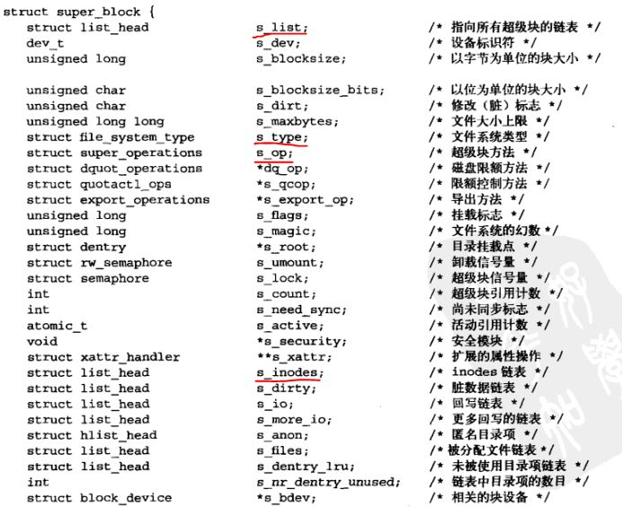  
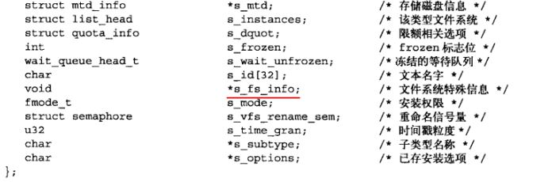  
需要注意的几个字段已经标识，其中超级快操作函数执行文件系统和索引节点的低层操作。  

inode包含了内核在操作文件和目录时需要的全部信息。  
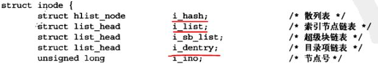  
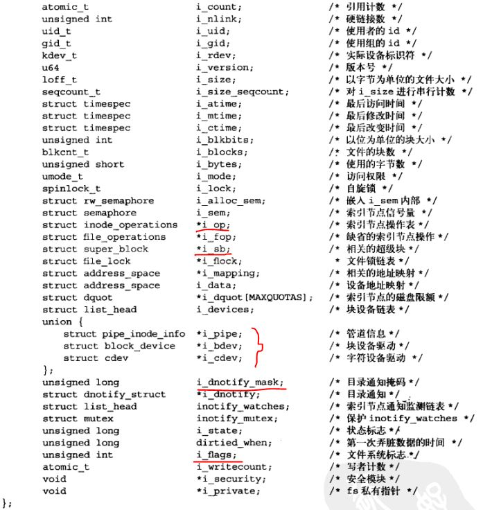  
大部分字段都能顾名思义。i_hash和i_list都是为了inode的查找。inode_operation用来描述操作索引节点对象的所有方法。i_flags我目前的理解是，是否时文件系统安装点。  
super_block和inode在磁盘上是有对应（这里对应的含义是：读取磁盘中的信息填充到内存中）的数据结构的。  
  
dentry，为了方便VFS的路径名查找，引入了这个结构。  
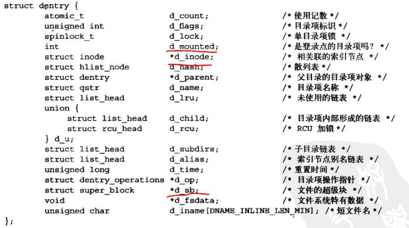  
有个字段比较费解，就是d_mounted，中文翻译是登录点，其实英文对应的是mount point。  
VFS访问路径名，会先在目录项缓存中搜索路径名（通过d_lookup()函数查找散列表dentry_hashtable）,如果找不到就遍历文件系统的每个路径分量，解析路径成目录项对象。  

file表示进程已打开的文件。
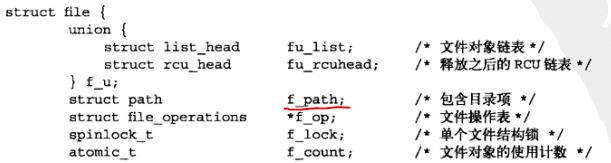  
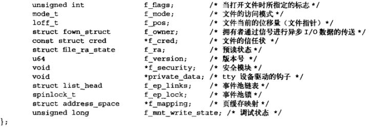  
    
和文件系统相关的数据结构  
file_system_type，用来描述各种特定文件系统的类型，例如ext2,ext3,UDF。  
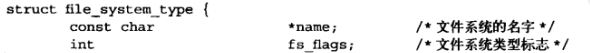  
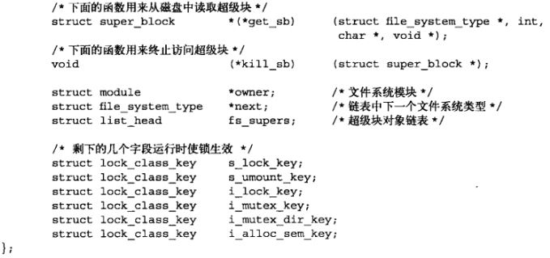  
这几个字段都挺重要的，其中fs_supers链接的是同一文件系统类型的超级块对象。  
  
vfsmount用来描述一个安装文件系统的实例，或者说代表一个安装点。  
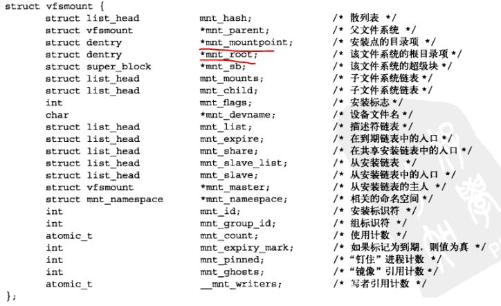  
里面有各种链表，跟踪和管理各种安装点的信息。  
  
和进程相关的数据结构    
files_struct由进程描述符中的files指向，所有与单个进程相关的信息（如打开的文件及文件描述符）都包含在其中。
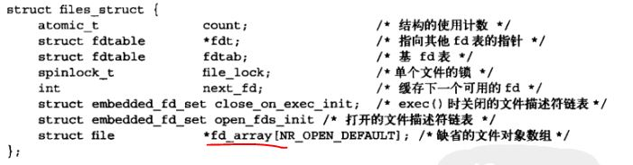  
fd_array数组指针指向已打开的文件对象。  
  
fs_struct由进程描述符的fs域指向，包含文件系统和进程的相关信息。  
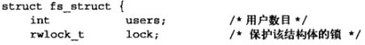  
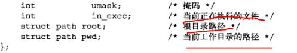  
  
  
这张图非常经典。要认真理解。  