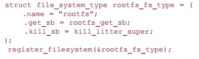
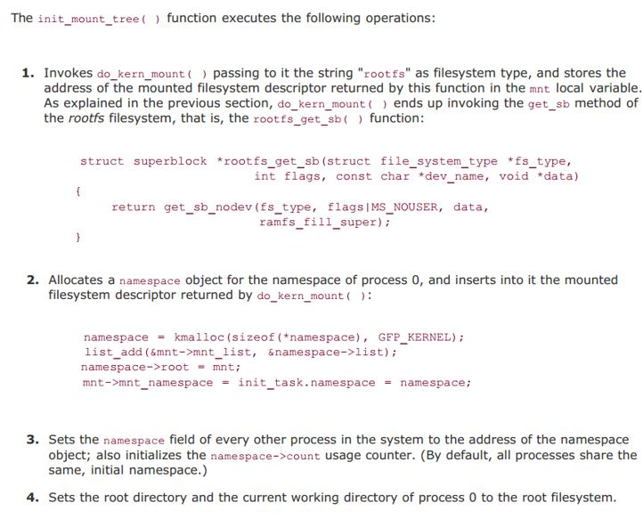
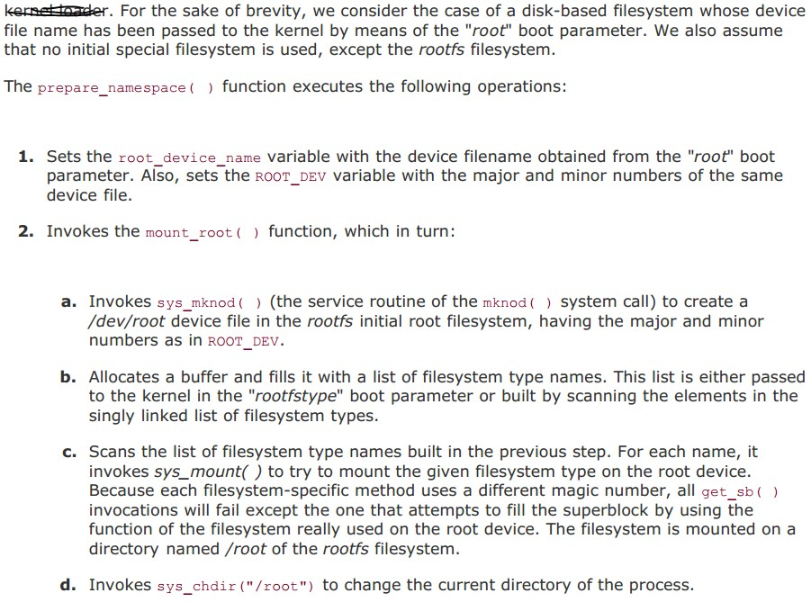
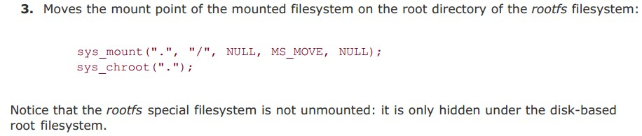

整理自《深入理解Linux内核》、《Linux内核设计与实现》。有空了再标详细出处。  
两篇比较好的文章：[Linux VFS中open系统调用实现原理](http://blog.chinaunix.net/uid-28362602-id-3425578.html)，[基于vfs实现自己的文件系统（下）](https://mp.weixin.qq.com/s?__biz=MzI3NzA5MzUxNA==&mid=2664602545&idx=1&sn=420236c7883dac2b5bdd6f720d1ccb74&scene=0&utm_source=tuicool&utm_medium=referral)  
我写这个的时候是诚惶诚恐呀，中断那部分算是理解的比较清晰，文件系统这个浩如烟海，还望指正。  
## 文件系统  
### 虚拟文件系统作用  
为用户空间程序提供了文件和文件系统相关的接口。系统中所有文件系统不但依赖vfs共存，而且也依靠vfs系统协同工作。程序可以利用标准的unix系统调用对不同的文件系统，甚至不同介质上的文件系统进行读写操作。  
### 主要数据结构  
super_block用于存储文件系统的信息。超级块对象通过alloc_super()函数创建并初始化，在文件系统安装时，文件系统会调用该函数以便从磁盘读取文件系统超级快，并且将其信息填充到内存中的超级块对象中。  
  
  
需要注意的几个字段已经标识，其中超级快操作函数执行文件系统和索引节点的低层操作。  

inode包含了内核在操作文件和目录时需要的全部信息。  
  
  
大部分字段都能顾名思义。i_hash和i_list都是为了inode的查找。inode_operation用来描述操作索引节点对象的所有方法。i_flags我目前的理解是，是否时文件系统安装点。  
super_block和inode在磁盘上是有对应（这里对应的含义是：读取磁盘中的信息填充到内存中）的数据结构的。  
  
dentry，为了方便VFS的路径名查找，引入了这个结构。  
  
有个字段比较费解，就是d_mounted，中文翻译是登录点，其实英文对应的是mount point。  
VFS访问路径名，会先在目录项缓存中搜索路径名（通过d_lookup()函数查找散列表dentry_hashtable）,如果找不到就遍历文件系统的每个路径分量，解析路径成目录项对象。  

file表示进程已打开的文件。  
  
  
    
和文件系统相关的数据结构  
file_system_type，用来描述各种特定文件系统的类型，例如ext2,ext3,UDF。  
  
  
这几个字段都挺重要的，其中fs_supers链接的是同一文件系统类型的超级块对象。  
  
vfsmount用来描述一个安装文件系统的实例，或者说代表一个安装点。  
  
里面有各种链表，跟踪和管理各种安装点的信息。  
  
和进程相关的数据结构    
files_struct由进程描述符中的files指向，所有与单个进程相关的信息（如打开的文件及文件描述符）都包含在其中。
  
fd_array数组指针指向已打开的文件对象。  
  
fs_struct由进程描述符的fs域指向，包含文件系统和进程的相关信息。  
  
  
  
  
这张图非常经典。要认真理解。  
  
### 普通文件系统的挂载  
1.调用path_lookup()查找安装点的路径名；查找的结果存放在nameidata类型的局部变量nd中。  
2.调用get_fs_type()在文件系统类型链表中搜索要安装文件系统的类型名，局部变量type保存对应file_system_type描述符的地址。  
3.调用alloc_vfsmnt()分配一个vfsmount，将其地址保存在mnt局部变量中。  
4.调用type->get_sb()分配并初始化一个超级块。  
5.设置mnt->mnt_sb字段。  
6.将mnt->mnt_root字段初始化为与文件系统根目录对应的目录项对象的地址，并且增加该目录项的引用计数数值。  
7.用graft_tree()把mnt插入当合适的链表中，设置mnt->mnt_parent字段。  
8.用current->namespace中的指初始化mnt->mnt_namespace字段。  
上面描述的不清楚，我感觉最关键的将“安装点”dentry 和“被安装设备”的根目录节点dentry关联起来，这一步完全没提。需要为被安装设备的根目录节点创建dentry和inode。需要设置被安装设备的super_block的s_root字段。需要设置安装点的inode的i_flags字段,安装点的dentry的d_mounted字段。需要设置被安装设备的vfsmount的mnt_mountpoint字段。  
### 根文件系统的挂载  
第一阶段：安装一个特殊rootfs文件系统，该文件系统仅提供一个作为初始安装点的空目录。该阶段由init_rootfs()和init_mount_tree()函数完成，它们在系统的初始化过程中执行。  
init_rootfs()函数注册特殊文件系统类型rootfs:  
  
  
第二阶段：内核在空目录上安装实际根文件系统。  
  
  
### open()系统调用  
open()系统调用的服务例程为sysopen()。  
课本上的官方参考是在深入理解linux内核的506页，但那个我没看懂。  
```
1.分配一个全新的struct file结构体，把当前进程的文件表扩展一个文件（即尝试添加一个struct file到当前进程的文件列表中），进程task_struct-> files_struct-> fd_array[NR_OPEN_DEFAULT]是一个struct file数组。  
2.根据传入的pathname查找或建立对应的dentry
	1).如果pathname中第一个字符是“/”，那么说明使用绝对路径，设置nameidata为根目录对应的dentry和当前目录的inode，mount点等
	2).如果不是“/”，则使用相对路径，设置nameidata为当前目录对应的dentry，inode，mount点等
	这两个信息都可以在当前进程进程描述符的fs字段找到。
	3).一层一层往下查找，直到找到最终的那个文件或者目录分量。  
		这里细说一下怎么一层层查找的：  
		首先查找缓存中是否要查找的dentry。  
		如果缓存中没有，就要调用上一层目录分量对应的dentry->d_inode这个inode的inode_operation->lookup，返回了新的dentry。  
		检查这个dentry是否是安装点，是通过dentry的d_mounted字段和dentry的d_inode的i_flags字段来判断的。  
		如果是安装点，调用follow_managed()函数找到最新的vfsmount。  
	4).最后一个文件分量用do_last()函数来处理。  
		也是如果此dentry不存在则创建它。  
		如果是创建文件，调用dentry->inode_operation->create来建立inode。  
		设置1中分配的file的各个字段，struct file结构体加入其自身inode所在超级块的所有文件链表中。
4.建立当前进程的files的fdtable与file的联系。fdtable是用来管理文件描述符的。  
```
