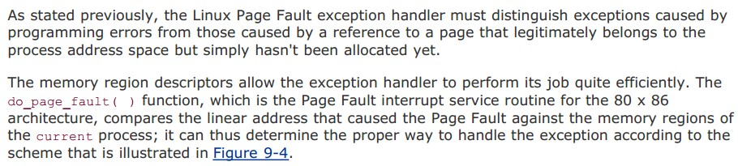
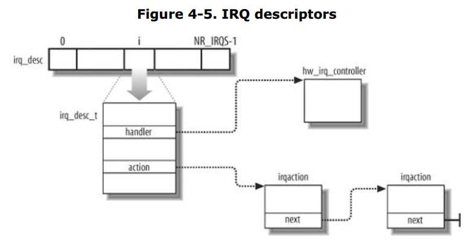
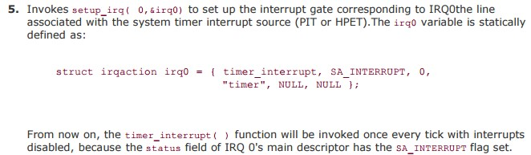

整理自《深入理解Linux内核》、《Linux内核设计与实现》。有空了再标详细出处。  
## 中断  
### 中断的作用  
处理器的速度和外围硬件设备的速度往往不在一个数量级上，内核应该在等待硬件回应期间处理其他事务，等硬件真正完成了请求的操作之后，再对其进行处理。轮询即让内核定期对设备状态进行查询，然后做成相应的处理，但是内核会做很多无用功，因为无论硬件设备是否正在工作，轮询总是周期性地重复执行。中断提供了一种机制，让硬件在需要的时候再向内核发送信号。中断本质上是一种特殊的电信号，处理器接收到中断后，会马上向操作系统反映此信号的到来，然后由操作系统负责处理这些新到来的数据。  

### 中断和异常初始化  
中断描述符表（Interrupt Descriptor Table,IDT）是一个系统表，它与每个中断或异常向量相关联，每一个向量在表中有相应的中断或异常处理程序的入口地址。IDT包含三种类型的描述符：任务门、中断门、陷阱门。中断门和陷阱门中都包含段选择符和中断或异常处理程序的段内偏移量。 idtr CPU寄存器使IDT可以位于内存的任何位置，它指定IDT的线性基地址及其限制（最大长度）。内核启用中断以前，必须把IDT表的初始地址装到idtr寄存器，并初始化表中的每项。这项工作是在初始化系统时完成的。  
#### IDT的初步初始化  
当计算机还运行在实模式时，IDT被初始化并由BIOS例程使用。然而，一旦Linux接管，IDT就被移到RAM的另一个区域，并进行第二次初始化，因为Linux没有利用任何BIOS例程。  
IDT存放在idt_table表中，有256个表项。6字节的idt_descr变量指定了IDT的大小和它的地址，只有当内核用lidt汇编指令初始化idtr寄存器时才用到这个变量。  
在内核初始化过程中，setup_idt()汇编函数用同一个中断门ignore_int()来填充所有这256个idt_table表项。  
```
ignore_int()  
用汇编语言写成的ignore_int()中断处理程序，可以看作一个空的处理程序，它执行下列动作：  
1.	在栈中保存一些寄存器的内容。  
2.	调用printk()函数打印Unknowninterrupt系统消息。  
3.	从栈恢复寄存器的内容。  
4.	执行iret指令以恢复被中断的程序。  
ignore_int()处理程序应该从不被执行，在控制台或日志文件中出现的Unknowninterrupt消息标志着要么是出现了一个硬件问题，要么就是出现了一个内核的问题。  
```
#### IDT第二遍初始化  
紧接着这个预初始化，内核将在IDT中进行第二遍初始化，用有意义的陷阱和断处理程序替换这个空处理程序。一旦这个过程完成，对控制单元产生的每个不同的异常，IDT都有一个专门的陷阱或系统门，而对于可编程中断控制器确认的每一个IRQ，IDT都将包含一个专门的中断门。
在接下来的两节中，将分别针对异常和中断来详细地说明这个工作是如何完成。
##### 异常初始化
CPU产生的大部分异常都是由Linux解释为出错条件。当其中一个异常发生时，内核就向引起异常的进程发送一个信号向它通知一个反常条件。这个进程将采取若干必要的步骤来恢复或者中止运行。  
```
异常处理程序有一个标准的结构，由以下三部分组成：  
在内核堆栈中保存大多数寄存器的内容。  
用高级C函数处理异常。  
通过ret_from_exception()函数从异常处理程序退出。  
```
为了利用异常，必須对IDT进行适当的初始化，使得每个被确认的异常都有一个异常处理程序。trap_init()函数的工作是将一些最终值插入到IDT的非屏蔽中断及异常表项中。这是由函数set_trap_gate()、set_intr_gate()、set_system_gate()、set_system_intr_gate()和set_task_gate()来完成的。  
##### 中断初始化  
init_IRQ()在interrupt数组（该数组指向同一个函数处理common_interrupt）中找到用于建立中断门的中断处理程序地址（这个地址对于所有中断是一致的，都是common_interrupt），通过set_intr_gate()函数将各函数的地址被复制到IDT相应表项的中断门中。  
```
common_interrupt:
	SAVE_ALL//在栈中保存中断处理程序可能会用到的所有CPU寄存器
		   //把用户数据段的选择符装到ds和es寄存器
	movl %esp,%eax//栈顶地址被保存到eax中
	call do_IRQ	//调用do_IRQ函数执行与一个中断相关的所有中断服务例程
	jmp ret_from_intr//调度、信号处理、恢复硬件上下文
 ```
### 中断处理的硬件部分  
中断是一种电信号，由硬件设备产生，并通过IRQ输出线送入中断控制器的输入引脚中。中断控制器是个简单的电子芯片，其作用是将多路中断管线，采用复用技术只通过一个和处理器相连接的管线和处理器通信。中断控制器监视IRQ线，检查产生的信号（如果多条IRQ线产生信号，选择引脚编号较小的IRQ线）；当接收到一个中断后，中断控制器会把接收到的引发信号转换成对应的向量，把这个向量存放在一个中断控制器的I/O端口，从而允许CPU通过数据总线读取这个向量；把引发信号发送给处理器的INTR引脚，即产生一个中断；等待，直到CPU把这个中断信号写进可编程中断控制器的一个I/O端口来确认它，此时，清INTR线。  
#### CPU硬件级的中断信号处理过程  
假定内核已被初始化，CPU在保护模式下运行。  
当执行了一条指令后，cs和eip这对寄存器包含下一条将要执行的指令的逻辑地址.在处理那条指令之前，控制单元会检查在运行前一条指令时是否已经发生了一个中断或异常。如果发生了一个中断或异常，那么控制单元执行下列操作:
```
1）确定与中断或异常关联的向量i (0 ≤ i ≤ 255)
2）读由idtr寄存器指向的IDT表中的第i项(在下面的描述中，我们假定IDT表项中包含的是一个中断门或一个陷阱门)。
3）从gdtr寄存器获得GDT的基地址，并在GDT中查找，以读取IDT表项中的选择符所标识的段描述符.这个描述符指定中断或异常处理程序所在段的基地址。
4）确信中断是由授权的(中断)发生源发出的。
5）检查是否发生了特权级的变化，也就是说，CPL是否不同于所选择的段描述符的DPL。
6）如果故障已发生，用引起异常的指令地址装载cs和eip寄存器，从而使得这条指令能再次被执行。 
7）在栈中保存eflags、 cs及eip的内容。
8）如果异常产生了一个硬件出错码，则将它保存在栈中。
9）装载cs和eip寄存器，其值分别是IDT表中第i项门描述符的段选择符和偏移量字段。这些值给出了中断或者异常处理程序的第一条指令的逻辑地址。
控制单元所执行的最后一步就是跳转到中断或者异常处理程序.换句话说.处理完中断信号后.控制单元所执行的指令就是被选中处理程序的第一条指令。
中断或异常被处理完后，相应的处理程序必须产生一条iret指令，把控制权转交给被中断的进程，这将迫使控制单元:用保存在栈中的值装载cs、 eip或eflags寄存器。如果一个硬件出错码曾被压入校中，并且在eip内容的上面，那么，执行iret指令前必须先弹出这个硬件出错码.
```

### 中断处理软件部分  
#### 异常处理之系统调用  
```
1.start_kernel()：trap_init()中有一句 set_system_trap_gate(SYSCALL_VECTOR,&system_call)。 其中：SYSCALL_VECTOR：系统调用的中断向量（#define SYSCALL_VECTOR 0x80），&system_call汇编代码入口。
2.一执行int $0x80，系统把cs:eip的值存储内核栈中，把ss:esp的值存储内核栈中，把eflags的值存储内核栈中；更新cs:eip的值为0x80的中断服务函数；将ss:esp的值指向了内核栈中的栈顶位置；跳转到system_call。
3.SAVE_ALL：保存现场
4.call *sys_call_table(,%eax,4)调用了系统调度处理函数，eax存的是系统调用号，是实际的系统调度程序。 sys_call_table：系统调用分派表
5.syscall_after_all：保存返回值
6.syscall退出，若有sys_exit_work，则进入sys_exit_work:执行的目的是处理进程之间的信号或者进程调度。
7.若无sys_exit_work，就执行restore_all恢复现场。
8.返回用户态，INTERRUPT_RETURN <=> iret，从内核栈中将:eflags、ss:esp、cs:eip这三个值依次恢复到寄存器中，并换回到用户态中来。
```
#### 异常处理之缺页异常  
  
  
### 中断处理  
如前所述，根据中断门的中断处理程序地址找到common_interrupt，主要是运行do_IRQ。  
  
irq_desc数组中的元素是irq_desc_t中断描述符，每一个中断号具有一个描述符，使用action链表连接共享同一个中断号的多个设备和中断。handler points to the hw_interrupt_type descriptor that identifies the PIC circuit servicing the IRQ line。handler指向发出这个中断的设备的处理对象hw_irq_controller,比如在单CPU，这个对象一般就是处理芯片8259的对象。为什么要指向这个对象呢？因为当发生中断的时候，内核需要对相应的中断进行一些处理，比如屏蔽这个中断等。这个时候需要对中断设备(比如8259芯片)进行操作，于是可以通过这个指针指向的对象进行操作。  
irqaction描述符，涉及一个特定的硬件设备和一个特定的中断。handler指向一个I/O设备的中断服务例程(这个handler是irqaction中的),name设备名，dev_id标志设备本身，next指向描述符链表的下一个元素。  
在激活一个准备利用irq线的设备之前其相应的驱动程序调用request_irq()注册中断处理程序。这个函数建立一个新的irqaction描述符，并用参数值初始化它。然后调用setup_irq()函数把这个描述符插入到适合的IRQ链表。如果setup_irq()返回一个出错码，设备驱动程序中止操作，这意味着IRQ线已有另一个设备所使用，而这个设备不允许中断共享。当设备操作结束时，驱动程序调用free_irq()函数从IRQ链表中删除这个描述符，并释放相应的内存区。  
比如说时钟中断的注册就是setup_irq(0,&irq0)  
#### do_IRQ()
unsigned int do_IRQ(struct pt_regs regs)通过pt_regs结构可以找到中断号，然后对接收到的中断进行应答irq_desc[irq].handler->ack(irq)，禁止这条线上的中断传递。接下来，do_IRQ() ensures that a valid handler is registered on the line and that it is enabled and not currently executing.如果是这样的，do_IRQ就调用handle_IRQ_event()来运行为这条中断线所安装的中断处理程序。  
handle_IRQ_event(),First,because the processor disabled interrupts,they are turned back on unless IRQ_DISABLED was specified during the handler’s registration.Next,each potential handler is executed in a loop.Finally,interrupts are again disable and the function returns.  
Back in do_IRQ(),the funcion cleans up and returns to the initial entry point通过irq_desc[irq].handler->end(irq),which then jumps to ret_from_intr().  
```
主要流程
unsigned int do_IRQ(struct pt_regs regs){
	通过pt_regs结构可以找到中断号;
	irq_desc[irq].handler->ack(irq);
	handle_IRQ_event(irq,regs,inq_desc[irq].action);
	irq_desc[irq].handler->end(irq);
}
irqreturn_t handler_IRQ_event(unsigned int irq,struct pt_regs regs,struct irqaction *action){
	local_irq_enable_in_hardirq();
	do{
		action->handler(irq,action->dev_id,regs);
		action=action->next;
	}while(action);
	local_irq_disable();
}
```
#### 时钟中断  
在内核初始化期间time_init()函数被调用来建立计时体系结构，它通常执行如下操作：  
```
1.初始化xtime变量。利用get_cmos_time()函数从实时时钟RTC中读取自1970年1月1日（UTC）午夜以来经历的秒数。
2.初始化wall_to_monotonic变量。这个变量和xtime一样是timespec类型，只不过它存放将被加到xtime上的秒数和纳秒数，以此来获得单向的时间流。
3.如果内核支持HPET，它将调用hpet_enable()函数确认ACPI固件是否探测到该芯片并将它的寄存器映射到了内存地址空间中。
4.调用select_timer()来挑选系统中可利用的最好的定时器资源，并设置cur_timer变量指向该定时器资源对应的定时器对象的地址。
5.调用setup_irq(0,&irq0)来创建与IRQ0相应的中断门，IRQ0引脚连接着系统时钟中断源（PIT或HPET）
```
##### 时钟中断处理函数的注册  
  
##### 时钟中断处理函数的调用  
时钟中断处理函数可以划分为两个部分：体系结构相关部分和体系结构无关部分。  
```
与体系结构相关的例程作为系统定时器的中断处理程序time_interrupt而注册到内核中，以便在产生时钟中断时，它都能够相应地运行。这部分处理程序主要完成：
*获得xtime_lock锁，以便对访问jiffies_64和墙上时间xtime进行保护
*需要时应答或重新设置系统时钟
*周期性地使用墙上时间更新实时时钟
*调用体系结构无关的时钟例程：tick_periodic()
中断服务程序主要通过调用与体系结构无关的例程tick_periodic执行下面的工作：
*给jiffies_64变量增加1
*更新资源消耗的统计值，比如当前进程所消耗的系统时间和用户时间
*执行已经到期的动态定时器
*执行scheduler_tick()函数
*更新墙上时间，该时间存放在xtime变量中
*计算平均负载
很多重要的操作是在do_timer和updata_process_times中进行。前者承担着对jiffies_64的实际增加操作，后者更新进程消耗的各种节拍数。
tick_periodic()执行完毕后，返回与体系结构相关的中断处理程序，继续执行后面的工作，释放xtime_lock锁，然后退出。
```